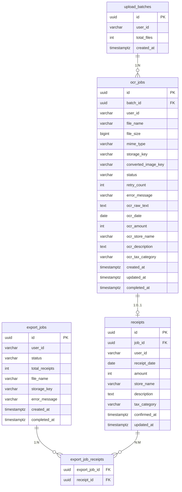

# DB スキーマ設計書

## 1. 概要

領収書 OCR アプリケーションのデータベーススキーマ設計。
4つの主要テーブルと1つの中間テーブルで構成する。

### 設計方針


| 項目       | 仕様                           |
| -------- | ---------------------------- |
| RDBMS    | PostgreSQL 16                |
| スキーマ     | `receipt_ocr`                |
| ID 形式    | UUID v4（`gen_random_uuid()`） |
| タイムスタンプ  | `TIMESTAMPTZ`（タイムゾーン付き）      |
| ステータス管理  | `VARCHAR` + `CHECK` 制約       |
| マルチテナント  | `user_id` を全テーブルに持たせて分離      |
| マイグレーション | Flyway                       |
| ORM      | MyBatis                      |


---

## 2. ER 図




---

## 3. テーブル詳細

### 3.1 upload_batches（アップロードバッチ）

アップロード操作の単位。1回のアップロードで1バッチが作成される。


| カラム         | 型           | 制約                            | 説明               |
| ----------- | ----------- | ----------------------------- | ---------------- |
| id          | UUID        | PK, DEFAULT gen_random_uuid() | バッチID            |
| user_id     | VARCHAR(64) | NOT NULL                      | JWTから取得したユーザー識別子 |
| total_files | INT         | NOT NULL                      | アップロードファイル数      |
| created_at  | TIMESTAMPTZ | NOT NULL, DEFAULT NOW()       | 作成日時             |


**インデックス:**


| 名前                         | カラム       | 用途           |
| -------------------------- | --------- | ------------ |
| idx_upload_batches_user_id | (user_id) | ユーザーごとのバッチ検索 |


---

### 3.2 ocr_jobs（OCR ジョブ）

ファイル単位のOCR処理ジョブ。OCR読み取り結果もインラインで保持する（1:1のため別テーブルにしない）。


| カラム                 | 型             | 制約                                 | 説明                                              |
| ------------------- | ------------- | ---------------------------------- | ----------------------------------------------- |
| id                  | UUID          | PK, DEFAULT gen_random_uuid()      | ジョブID                                           |
| batch_id            | UUID          | NOT NULL, FK -> upload_batches(id) | 所属バッチ                                           |
| user_id             | VARCHAR(64)   | NOT NULL                           | ユーザー識別子                                         |
| file_name           | VARCHAR(255)  | NOT NULL                           | 元ファイル名                                          |
| file_size           | BIGINT        | NOT NULL                           | ファイルサイズ（bytes）                                  |
| mime_type           | VARCHAR(50)   | NOT NULL                           | MIMEタイプ（image/jpeg, image/png, application/pdf） |
| storage_key         | VARCHAR(512)  | NOT NULL                           | MinIOオブジェクトキー（原本）                               |
| converted_image_key | VARCHAR(512)  |                                    | PDF変換後の画像キー（PDFの場合のみ使用）                         |
| status              | VARCHAR(20)   | NOT NULL, CHECK                    | ジョブステータス（後述）                                    |
| retry_count         | INT           | NOT NULL, DEFAULT 0                | 現在のリトライ回数（0〜3）                                  |
| error_message       | VARCHAR(1000) |                                    | エラーメッセージ（失敗時のみ）                                 |
| ocr_raw_text        | TEXT          |                                    | OCR生テキスト全文                                      |
| ocr_date            | DATE          |                                    | 読み取り結果: 取引日                                     |
| ocr_amount          | INT           |                                    | 読み取り結果: 金額（円）                                   |
| ocr_store_name      | VARCHAR(200)  |                                    | 読み取り結果: 店名                                      |
| ocr_description     | TEXT          |                                    | 読み取り結果: 品目・明細                                   |
| ocr_tax_category    | VARCHAR(20)   |                                    | 読み取り結果: 税区分                                     |
| created_at          | TIMESTAMPTZ   | NOT NULL, DEFAULT NOW()            | 作成日時                                            |
| updated_at          | TIMESTAMPTZ   | NOT NULL, DEFAULT NOW()            | 更新日時（トリガーで自動更新）                                 |
| completed_at        | TIMESTAMPTZ   |                                    | 処理完了日時                                          |


**制約:**


| 種別    | 内容                                                                     |
| ----- | ---------------------------------------------------------------------- |
| CHECK | status IN ('QUEUED', 'PROCESSING', 'COMPLETED', 'CONFIRMED', 'FAILED') |
| CHECK | retry_count >= 0 AND retry_count <= 3                                  |
| FK    | batch_id -> upload_batches(id) ON DELETE RESTRICT                      |


**インデックス:**


| 名前                       | カラム               | 用途               |
| ------------------------ | ----------------- | ---------------- |
| idx_ocr_jobs_batch_id    | (batch_id)        | バッチ内ジョブ一覧取得      |
| idx_ocr_jobs_user_status | (user_id, status) | ユーザーごとのステータス絞り込み |


---

### 3.3 receipts（確定済みレシート）

ユーザーが確認・編集して「確定」したデータ。画面Cの一覧・エクスポート対象。


| カラム          | 型            | 制約                                   | 説明                     |
| ------------ | ------------ | ------------------------------------ | ---------------------- |
| id           | UUID         | PK, DEFAULT gen_random_uuid()        | レシートID                 |
| job_id       | UUID         | NOT NULL, UNIQUE, FK -> ocr_jobs(id) | 元ジョブ（1:1関係）            |
| user_id      | VARCHAR(64)  | NOT NULL                             | ユーザー識別子                |
| receipt_date | DATE         | NOT NULL                             | 取引日                    |
| amount       | INT          | NOT NULL, CHECK (amount >= 1)        | 支払総額（円）                |
| store_name   | VARCHAR(200) | NOT NULL                             | 支払先                    |
| description  | TEXT         |                                      | 品目・明細（最大500文字はアプリ層で制御） |
| tax_category | VARCHAR(20)  |                                      | 税区分（"8%", "10%" 等）     |
| confirmed_at | TIMESTAMPTZ  | NOT NULL, DEFAULT NOW()              | 確定日時                   |
| updated_at   | TIMESTAMPTZ  | NOT NULL, DEFAULT NOW()              | 更新日時（トリガーで自動更新）        |


- カラム名を `receipt_date` とした理由: `date` は PostgreSQL の予約語のため

**制約:**


| 種別     | 内容                                        |
| ------ | ----------------------------------------- |
| UNIQUE | job_id（1つのジョブから1つのレシートのみ作成可能）             |
| CHECK  | amount >= 1                               |
| FK     | job_id -> ocr_jobs(id) ON DELETE RESTRICT |


**インデックス:**


| 名前                       | カラム                          | 用途              |
| ------------------------ | ---------------------------- | --------------- |
| idx_receipts_user_date   | (user_id, receipt_date DESC) | 日付範囲検索・デフォルトソート |
| idx_receipts_user_store  | (user_id, store_name)        | 店名部分一致検索        |
| idx_receipts_user_amount | (user_id, amount)            | 金額範囲フィルタ        |


---

### 3.4 export_jobs（エクスポートジョブ）

CSV エクスポートの非同期処理ジョブ。


| カラム            | 型             | 制約                            | 説明                    |
| -------------- | ------------- | ----------------------------- | --------------------- |
| id             | UUID          | PK, DEFAULT gen_random_uuid() | エクスポートID              |
| user_id        | VARCHAR(64)   | NOT NULL                      | ユーザー識別子               |
| status         | VARCHAR(20)   | NOT NULL, CHECK               | ジョブステータス（後述）          |
| total_receipts | INT           | NOT NULL                      | 対象レシート数               |
| file_name      | VARCHAR(255)  |                               | 生成CSVファイル名（完了後に設定）    |
| storage_key    | VARCHAR(512)  |                               | MinIOオブジェクトキー（完了後に設定） |
| error_message  | VARCHAR(1000) |                               | エラーメッセージ（失敗時のみ）       |
| created_at     | TIMESTAMPTZ   | NOT NULL, DEFAULT NOW()       | 作成日時                  |
| completed_at   | TIMESTAMPTZ   |                               | 完了日時                  |


**制約:**


| 種別    | 内容                                                        |
| ----- | --------------------------------------------------------- |
| CHECK | status IN ('QUEUED', 'PROCESSING', 'COMPLETED', 'FAILED') |


**インデックス:**


| 名前                      | カラム       | 用途              |
| ----------------------- | --------- | --------------- |
| idx_export_jobs_user_id | (user_id) | ユーザーごとのエクスポート検索 |


---

### 3.5 export_job_receipts（エクスポート対象レシート中間テーブル）

エクスポートジョブとレシートの多対多関係を管理する中間テーブル。


| カラム           | 型    | 制約                                                | 説明        |
| ------------- | ---- | ------------------------------------------------- | --------- |
| export_job_id | UUID | NOT NULL, FK -> export_jobs(id) ON DELETE CASCADE | エクスポートジョブ |
| receipt_id    | UUID | NOT NULL, FK -> receipts(id) ON DELETE CASCADE    | レシート      |


**制約:**


| 種別  | 内容                                                 |
| --- | -------------------------------------------------- |
| PK  | (export_job_id, receipt_id)                        |
| FK  | export_job_id -> export_jobs(id) ON DELETE CASCADE |
| FK  | receipt_id -> receipts(id) ON DELETE CASCADE       |


**インデックス:**


| 名前                              | カラム          | 用途          |
| ------------------------------- | ------------ | ----------- |
| idx_export_job_receipts_receipt | (receipt_id) | レシート側からの逆引き |


---

## 4. ステータス遷移

### 4.1 OCR ジョブステータス（ocr_jobs.status）

```
QUEUED → PROCESSING → COMPLETED → CONFIRMED
                ↓
             FAILED
```


| ステータス      | 説明                   | 遷移先               |
| ---------- | -------------------- | ----------------- |
| QUEUED     | キューに投入済み、処理待ち        | PROCESSING        |
| PROCESSING | OCR 処理中              | COMPLETED, FAILED |
| COMPLETED  | OCR 処理完了、ユーザーの確認待ち   | CONFIRMED         |
| CONFIRMED  | ユーザーが確認・編集して確定済み     | （終端）              |
| FAILED     | 自動リトライ（最大3回）を含めすべて失敗 | QUEUED（手動リトライ時）   |


### 4.2 エクスポートジョブステータス（export_jobs.status）

```
QUEUED → PROCESSING → COMPLETED
                ↓
             FAILED
```


| ステータス      | 説明                | 遷移先               |
| ---------- | ----------------- | ----------------- |
| QUEUED     | キューに投入済み、処理待ち     | PROCESSING        |
| PROCESSING | CSV 生成中           | COMPLETED, FAILED |
| COMPLETED  | CSV 生成完了、ダウンロード可能 | （終端）              |
| FAILED     | エクスポート処理失敗        | （終端）              |


---

## 5. 設計判断の根拠

### 5.1 OCR結果のインライン格納

`ocr_jobs` テーブルに OCR 読み取り結果を直接格納する（`ocr_results` テーブルに分離しない）。

**検討した代替案: `ocr_results` テーブルへの分離**

```
ocr_jobs    → ジョブの状態管理（status, retry_count など）
ocr_results → OCR結果（ocr_date, ocr_amount など）← OCR完了時に INSERT
```

分離案のメリットは、テーブルの責務が明確になり（第3正規形に近い）、QUEUED/PROCESSING 中に `ocr_*` カラムが全 NULL で存在するという不自然さがなくなる点。

**インラインを選択した理由:**


| 観点       | 判断                                             |
| -------- | ---------------------------------------------- |
| 関係       | ocr_jobs と OCR 結果は完全に 1:1 かつ常に同時に参照する。分離の利点が薄い |
| クエリ      | JOIN なしで 1 クエリで全情報を取得できる                       |
| MyBatis  | ResultMap のネストが不要でマッピングが単純                     |
| トランザクション | OCR完了時に 1 テーブルを UPDATE するだけ                    |
| 規模       | 学習プロジェクトとして JOIN を減らしシンプルに保つのが合理的              |


`ocr`_ プレフィックスで名前空間を揃えることで、可読性は担保している。OCR結果を複数バージョン管理する要件や大規模システムへの拡張が生じた場合は、分離テーブルへのマイグレーションを検討する。

### 5.2 converted_image_key の保存

PDF ファイルは OCR エンジン（Tesseract）が直接処理できないため、PDFBox で **PDF → JPEG に変換**してから OCR にかける。変換後の画像は MinIO に別オブジェクトとして保存され、そのキーを `converted_image_key` に記録する。

```
[MinIO: receipt-uploads/]
  {batchId}/original.pdf     ← storage_key（原本）
  {batchId}/converted.jpg    ← converted_image_key（変換後）
```

画面B の画像プレビュー（`GET /ocr-jobs/{jobId}/image-url`）は、PDF の場合に変換済み画像の署名付き URL を返すためにこのキーを使用する。JPEG/PNG の場合は変換不要なので `NULL` のまま。

### 5.3 ocr_raw_text（OCR 生テキスト）の保存

OCR が読み取った生テキスト全文を保存する理由は以下の通り。


| 目的   | 説明                                  |
| ---- | ----------------------------------- |
| デバッグ | 項目の誤読が発生したとき「生テキストでは何と読んだか」を確認できる   |
| 再解析  | パース処理を改善した場合、再 OCR せずに生テキストから再抽出できる |
| 監査証跡 | 「機械が読んだ原文」を残すことで、ユーザーの編集内容との差分を追える  |


### 5.4 OCR 読み取り項目の固定カラム vs JSONB

OCR 読み取り結果（`ocr_date`, `ocr_amount` など）を固定カラムで持つか、JSONB カラム1つで持つかを検討した。

**検討した代替案: JSONB カラム**

```sql
ocr_result JSONB  -- {"date": "2026-02-15", "amount": 3980, "storeName": "東京文具店", ...}
```


| 観点            | 固定カラム（採用）                 | JSONB                                       |
| ------------- | ------------------------- | ------------------------------------------- |
| 拡張性           | 項目追加のたびに ALTER TABLE が必要  | JSON のキーを増やすだけ                              |
| 型安全性          | DB レベルで型・制約を保証            | アプリ側での保証が必要                                 |
| SQL での検索      | `WHERE ocr_amount > 1000` | `WHERE (ocr_result->>'amount')::int > 1000` |
| インデックス        | 通常の B-tree                | GIN インデックスが必要                               |
| MyBatis マッピング | 単純                        | JSONB ↔ Java オブジェクト変換が必要                    |


**固定カラムを選択した理由:**

要件定義で読み取り項目は「日付・金額・店名・品目・税区分」の5項目に固定されており、インボイス番号などの追加はスコープ外として明示的に除外されている。読み取り項目の変更が見込めない今回の規模では、固定カラムの方がシンプルで扱いやすい。読み取り項目の動的な追加が求められる場合は JSONB への移行を検討する。

### 5.6 receipts テーブルの独立性

`ocr_jobs` から `receipts` へのデータコピー（意図的な非正規化）。

- OCR結果（機械読み取り値）と確定データ（ユーザー修正済み値）を明確に分離
- 画面Cの一覧クエリが `receipts` テーブル単体で完結し、JOIN 不要
- エクスポート処理も `receipts` + `export_job_receipts` のみで完結

### 5.7 VARCHAR + CHECK によるステータス管理

PostgreSQL ENUM 型ではなく VARCHAR + CHECK 制約を採用。

- ENUM 型は値の追加に `ALTER TYPE` が必要で、Flyway マイグレーションが煩雑
- VARCHAR + CHECK なら、新ステータス追加時は CHECK 制約の変更のみ
- アプリケーション側の Java enum との対応も容易

### 5.8 updated_at の自動更新

PostgreSQL のトリガー関数で `updated_at` を自動更新する。

- アプリケーション側での設定漏れを防止
- MyBatis の UPDATE 文で `updated_at` を意識する必要がなくなる

### 5.9 ON DELETE の方針


| 関係                                 | 方針       | 理由                     |
| ---------------------------------- | -------- | ---------------------- |
| ocr_jobs -> upload_batches         | RESTRICT | バッチを誤って削除しない           |
| receipts -> ocr_jobs               | RESTRICT | レシートが存在するジョブを削除しない     |
| export_job_receipts -> export_jobs | CASCADE  | エクスポートジョブ削除時に中間レコードも削除 |
| export_job_receipts -> receipts    | CASCADE  | レシート削除時に中間レコードも削除      |


---

## 6. API レスポンスとのマッピング

### upload_batches + ocr_jobs -> POST /api/upload-batches レスポンス


| API フィールド       | DB カラム                     |
| --------------- | -------------------------- |
| batchId         | upload_batches.id          |
| jobs[].jobId    | ocr_jobs.id                |
| jobs[].fileName | ocr_jobs.file_name         |
| jobs[].fileSize | ocr_jobs.file_size         |
| jobs[].mimeType | ocr_jobs.mime_type         |
| jobs[].status   | ocr_jobs.status            |
| totalFiles      | upload_batches.total_files |


### upload_batches + ocr_jobs -> GET /api/upload-batches レスポンス（バッチ一覧）


| API フィールド          | DB カラム / 算出方法                                       |
| -------------------- | -------------------------------------------------------- |
| content[].batchId    | upload_batches.id                                        |
| content[].totalFiles | upload_batches.total_files                               |
| content[].summary.*  | ocr_jobs の status を GROUP BY で集計（batch_id で絞り込み） |
| content[].createdAt  | upload_batches.created_at                                |

`summary` の各フィールド（total, queued, processing, completed, confirmed, failed）は `ocr_jobs` テーブルの `status` カラムを `COUNT` + `CASE WHEN` で集計して算出する。


### ocr_jobs -> GET /api/ocr-jobs/{jobId} レスポンス


| API フィールド             | DB カラム                    |
| --------------------- | ------------------------- |
| ocrResult.date        | ocr_jobs.ocr_date         |
| ocrResult.amount      | ocr_jobs.ocr_amount       |
| ocrResult.storeName   | ocr_jobs.ocr_store_name   |
| ocrResult.description | ocr_jobs.ocr_description  |
| ocrResult.taxCategory | ocr_jobs.ocr_tax_category |
| ocrResult.rawText     | ocr_jobs.ocr_raw_text     |


### receipts -> GET /api/receipts レスポンス


| API フィールド   | DB カラム                |
| ----------- | --------------------- |
| receiptId   | receipts.id           |
| date        | receipts.receipt_date |
| amount      | receipts.amount       |
| storeName   | receipts.store_name   |
| description | receipts.description  |
| taxCategory | receipts.tax_category |
| confirmedAt | receipts.confirmed_at |
| updatedAt   | receipts.updated_at   |


---

**作成日**: 2026-02-28
**版数**: 1.1
**ステータス**: バッチ一覧 API マッピング追加