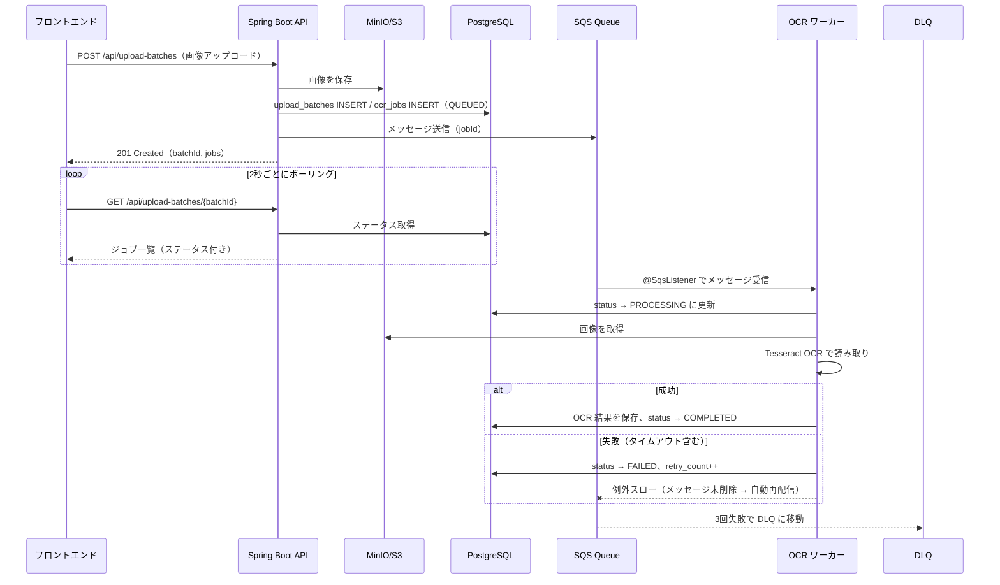
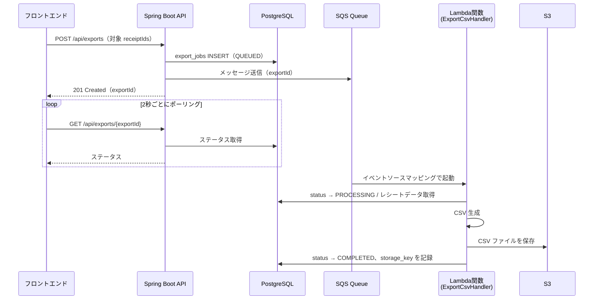
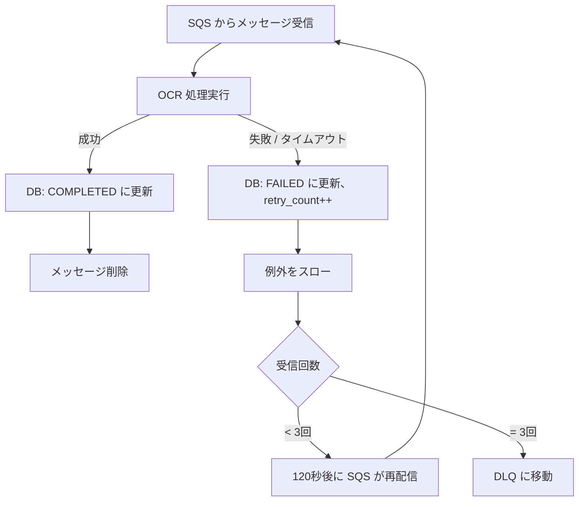

# 非同期処理フロー設計書

## 1. 概要

領収書 OCR アプリケーションの非同期処理設計。
OCR 読み取りと CSV エクスポートをキューイングし、バックグラウンドで並列処理する仕組みを定義する。

### 設計方針

| 項目 | 仕様 |
|---|---|
| メッセージキュー | Amazon SQS（Standard Queue） |
| ローカル代替 | LocalStack |
| OCR ワーカー実行基盤 | Spring Boot アプリ内（`@SqsListener`、API と同居） |
| エクスポート実行基盤 | AWS Lambda（SQS イベントソースマッピング） |
| フロントエンド通知 | フロントエンドポーリング（2秒間隔） |

### 対象フロー

| フロー | 非同期処理の内容 | キュー |
|---|---|---|
| フロー① | 領収書画像の OCR 読み取り | `receipt-ocr-queue` |
| フロー② | 確定済みレシートの CSV エクスポート | `receipt-export-queue` |

---

## 2. 全体フロー図

### 2.1 OCR フロー



### 2.2 エクスポートフロー



---

## 3. SQS キュー定義

### 3.1 キュー一覧

| キュー名 | 用途 | DLQ |
|---|---|---|
| `receipt-ocr-queue` | OCR ジョブの処理 | `receipt-ocr-queue-dlq` |
| `receipt-export-queue` | CSV エクスポートジョブの処理 | `receipt-export-queue-dlq` |

### 3.2 キュー設定

| 設定項目 | 値 | 説明 |
|---|---|---|
| Queue Type | Standard | 順序保証は不要（各ジョブは独立） |
| Visibility Timeout | 120秒 | メッセージ取得後、処理完了まで他ワーカーに再配信しない期間 |
| Message Retention Period | 4日（デフォルト） | 未処理メッセージの保持期間 |
| Receive Message Wait Time | 20秒 | ロングポーリングの最大待機時間 |

### 3.3 デッドレターキュー（DLQ）設定

| 設定項目 | 値 | 説明 |
|---|---|---|
| maxReceiveCount | 3 | 3回処理に失敗したメッセージを DLQ に移動 |
| Message Retention Period | 14日 | 障害調査のため長めに保持 |

### 3.4 メッセージ形式

**OCR ジョブ**

```json
{
  "jobId": "550e8400-e29b-41d4-a716-446655440000",
  "batchId": "660e8400-e29b-41d4-a716-446655440000",
  "storageKey": "uploads/660e.../receipt.jpg",
  "mimeType": "image/jpeg"
}
```

**エクスポートジョブ**

```json
{
  "exportId": "770e8400-e29b-41d4-a716-446655440000",
  "userId": "user-001"
}
```

---

## 4. ワーカー設計

### 4.1 アーキテクチャ

OCR ワーカーは Spring Boot アプリ内に同居する。エクスポート処理は AWS Lambda で実行する。

```
[Spring Boot Application]
├── Controller 層     ← REST API を受け付ける
├── Service 層        ← ビジネスロジック
└── OCR Worker        ← SQS からジョブを取得して OCR 処理（@SqsListener）

[AWS Lambda: ExportCsvHandler]
└── SQS イベントソースマッピングでエクスポート処理を実行
```

### 4.2 並列数設定

| ワーカー | 並列制御 | 根拠 |
|---|---|---|
| OCR ワーカー | 3スレッド（`@SqsListener`） | Tesseract は CPU を多く使うため、3並列が上限 |
| エクスポート Lambda | 予約同時実行数 3 | SQS バッチサイズ 1 で逐次処理。Lambda の同時実行数で並列度を制御 |

### 4.3 メッセージ消費方式

#### OCR ワーカー（Spring Boot 内）

Spring Cloud AWS の `@SqsListener` を使用する。

```java
@SqsListener("receipt-ocr-queue")
public void handleOcrJob(OcrJobMessage message) {
    // 1. DB ステータスを PROCESSING に更新
    // 2. MinIO から画像を取得
    // 3. Tesseract OCR で読み取り
    // 4. DB に結果を保存（COMPLETED に更新）
    // 失敗時は例外をスロー → SQS が自動再配信
}
```

- `@SqsListener` がロングポーリング（最大20秒待機）を自動で行う
- メッセージの取得・パース・削除をフレームワークが管理
- 処理成功時にメッセージを自動削除、例外スロー時はメッセージが残り再配信される

#### エクスポート Lambda（AWS Lambda）

SQS イベントソースマッピングにより Lambda 関数が起動される。

```java
public class ExportCsvHandler implements RequestHandler<SQSEvent, Void> {
    @Override
    public Void handleRequest(SQSEvent event, Context context) {
        // 1. SQS メッセージからエクスポートジョブ情報を取得
        // 2. DB: status → PROCESSING に更新 / レシートデータ取得
        // 3. CSV 生成
        // 4. S3 に CSV ファイルを保存
        // 5. DB: status → COMPLETED、storage_key を記録
        // 失敗時は例外をスロー → SQS が自動再配信
    }
}
```

- SQS がメッセージを検出すると Lambda を自動起動（イベントソースマッピング）
- Lambda が正常終了するとメッセージが自動削除される
- Lambda が例外をスローするとメッセージが残り、Visibility Timeout 後に再配信される
- `ReservedConcurrentExecutions: 3` で同時実行数を制限

---

## 5. リトライ・タイムアウト設計

### 5.1 自動リトライフロー

SQS の再配信メカニズムに全面的に委譲する。アプリ側ではリトライ回数を管理しない。



### 5.2 タイムアウト設計

| 対象 | タイムアウト時間 | 根拠 |
|---|---|---|
| OCR 処理 | 60秒 | 画像取得 + OCR 実行 + DB 保存の最大所要時間を考慮。`CompletableFuture.get(60, SECONDS)` で制御 |
| エクスポート Lambda | 300秒（5分） | Lambda のタイムアウト設定（`Timeout: 300`）で制御。大量レシートの DB 読み取り + CSV 生成を考慮 |

**タイムアウト時の挙動:**
- DB の `status` を `FAILED` に更新し `retry_count` をインクリメント
- 例外を再スローして SQS の自動再配信に乗せる（通常の失敗と同じ扱い）

**Visibility Timeout との関係:**

```
[タイムアウト: 60秒] < [Visibility Timeout: 120秒]
```

タイムアウトが先に発火するため、Visibility Timeout 内に処理の成功・失敗が必ず確定する。Visibility Timeout が先に切れて二重処理が起きることはない。

### 5.3 手動リトライ

自動リトライ（3回）が全て失敗した後、ユーザーが画面B の「再試行」ボタンから手動リトライを行える。

| 項目 | 仕様 |
|---|---|
| API | `POST /api/ocr-jobs/{jobId}/retry` |
| 前提条件 | `status = FAILED` のジョブのみ実行可能 |
| 回数制限 | 上限なし |
| 挙動 | `retry_count` をリセット → `status` を `QUEUED` に変更 → SQS にメッセージを再投入 |

### 5.4 冪等性の保証

同一ジョブが複数回処理されても結果が変わらないことを保証する。

| 対策 | 説明 |
|---|---|
| ステータスチェック | ワーカーは処理開始時に `status = QUEUED` であることを確認。既に `PROCESSING` / `COMPLETED` の場合はスキップ |
| DB の楽観ロック | `updated_at` を条件に含めた UPDATE で競合を検知 |

---

## 6. フロントエンド連携

### 6.1 ステータス通知方式

フロントエンドポーリング方式を採用する。

| 項目 | 仕様 |
|---|---|
| 方式 | フロントエンドから定期的に API を呼び出し |
| ポーリング間隔 | 2秒 |
| 停止条件 | バッチ内の全ジョブが終端ステータス（COMPLETED / CONFIRMED / FAILED）に到達 |

### 6.2 ポーリング対象 API

| フロー | API | レスポンスに含まれるステータス |
|---|---|---|
| OCR | `GET /api/upload-batches/{batchId}` | 各ジョブの `status`（QUEUED / PROCESSING / COMPLETED / FAILED） |
| エクスポート | `GET /api/exports/{exportId}` | エクスポートジョブの `status` |

### 6.3 フロントエンド実装イメージ

```
アップロード完了
  ↓
setInterval（2秒ごと）
  ├─ GET /api/upload-batches/{batchId}
  ├─ 各ジョブのステータスを UI に反映
  └─ 全ジョブが終端ステータス → clearInterval（ポーリング停止）
```

---

## 7. ローカル開発環境

### 7.1 構成

| サービス | ツール | 用途 |
|---|---|---|
| SQS | LocalStack | メッセージキューのエミュレート |
| S3 | MinIO | オブジェクトストレージ（既存） |
| DB | PostgreSQL | データベース（既存） |
| Lambda | SAM CLI | エクスポート Lambda のローカル実行 |

### 7.2 docker-compose 構成

```
docker-compose.yml
├── postgres        （既存）
├── minio           （既存）
└── localstack      （追加）← SQS をエミュレート
```

LocalStack は SQS のエミュレートのみに使用する。S3 は MinIO で代替済みのため、LocalStack の S3 機能は使わない。

起動時にキューを自動作成する初期化スクリプトを用意し、開発者が手動でキューを作成する手間を省く。

### 7.3 Lambda のローカル実行

エクスポート Lambda は SAM CLI でローカル実行する。

```bash
# Lambda 関数のビルド
cd lambda/export-csv
sam build

# ローカルで Lambda を単体実行（テストイベントを入力）
sam local invoke ExportCsvFunction --event events/test-event.json

# ローカルの SQS と連携する場合は、Lambda を直接ビルド・実行して検証
```

- SAM CLI は Docker を利用して Lambda ランタイムをローカルでエミュレートする
- DB・S3（MinIO）への接続は環境変数で切り替える（`application.yml` ではなく Lambda の環境変数）

---

## 8. 設計判断の根拠

### 8.1 Amazon SQS の採用

| 候補 | 評価 | 不採用の理由 |
|---|---|---|
| Spring `@Async` | △ | サーバー再起動でキュー内タスクが消失。ステータス管理がアプリ側に集中 |
| PostgreSQL SKIP LOCKED | ○ | 実現可能だが、キューイングの学習テーマとしての経験値が限定的 |
| RabbitMQ | ○ | AMQP プロトコルの学習にはなるが、AWS 実務での活用機会が SQS より少ない |
| **Amazon SQS** | **◎** | **AWS 実務で最も使用頻度が高い。DLQ・可視性タイムアウト等の概念を実践的に習得できる** |

### 8.2 @SqsListener の採用

Spring Cloud AWS の `@SqsListener` を採用し、`@Scheduled` による自前ポーリングは不採用とした。

| 観点 | @SqsListener（採用） | @Scheduled 自前ポーリング |
|---|---|---|
| 実装量 | 少ない | 多い（SQS SDK 操作を手動記述） |
| ロングポーリング | 自動管理 | 手動実装 |
| メッセージ削除 | 自動管理 | 手動実装 |
| 学習効率 | リトライ・タイムアウト設計に集中できる | SQS SDK の低レベル操作に時間を取られる |

### 8.3 フロントエンドポーリングの採用

| 候補 | 評価 | 不採用の理由 |
|---|---|---|
| **フロントエンドポーリング** | **◎** | **実装がシンプル。今回の規模では十分** |
| SSE（Server-Sent Events） | ○ | リアルタイム性は高いが、他の学習テーマとの実装負荷のバランスを考慮して見送り |
| WebSocket | △ | 双方向通信は不要（サーバー → フロント方向のみ）。オーバースペック |

### 8.4 エクスポート処理の Lambda 化

エクスポートワーカーを Spring Boot 内の `@SqsListener` から AWS Lambda に移行した。

| 観点 | Spring Boot 同居（変更前） | AWS Lambda（採用） |
|---|---|---|
| 学習テーマ | SQS + ワーカーのみ | SQS + Lambda のサーバーレスパターンを追加習得 |
| リソース効率 | エクスポート未使用時もスレッドプールを確保 | リクエスト時のみ起動。未使用時のコストがゼロ |
| スケーラビリティ | Spring Boot の JVM リソースに制約 | Lambda の同時実行数で柔軟にスケール |
| デプロイ独立性 | API と同時デプロイが必要 | Lambda は独立してデプロイ可能 |

**OCR ではなくエクスポートを選んだ理由:**

- エクスポート処理は軽量（DB 読み取り + CSV 生成 + S3 保存）で、ネイティブライブラリが不要
- Tesseract OCR はネイティブライブラリ（C++ ランタイム）を必要とし、Lambda コンテナイメージのサイズが大きくなる。コールドスタートの遅延がポートフォリオのデモに不向き
- エクスポートは SQS → Lambda の典型的なサーバーレスパターンであり、学習効果が高い

**素の Lambda ランタイムを採用した理由:**

| 候補 | 評価 | 不採用の理由 |
|---|---|---|
| **素の Lambda（aws-lambda-java-core）** | **◎** | **コールドスタートが軽量（数秒）。依存が少なくデプロイパッケージが小さい** |
| Spring Cloud Function | △ | Spring コンテナの初期化に 10〜20 秒かかり、コールドスタートが重い |

---

**作成日**: 2026-02-28
**版数**: 1.1
**ステータス**: Lambda 化対応
