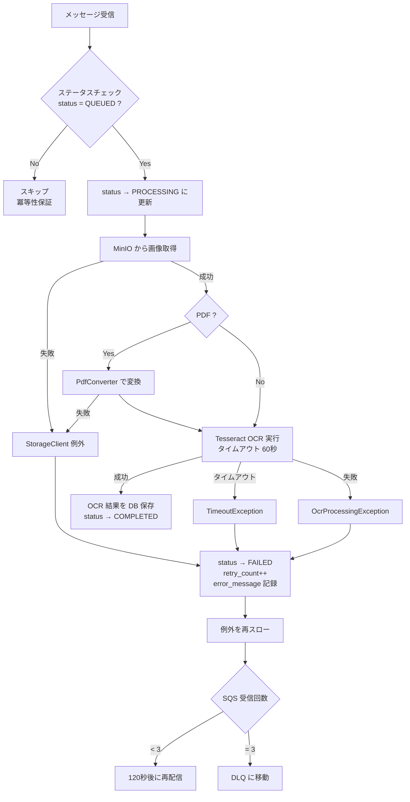
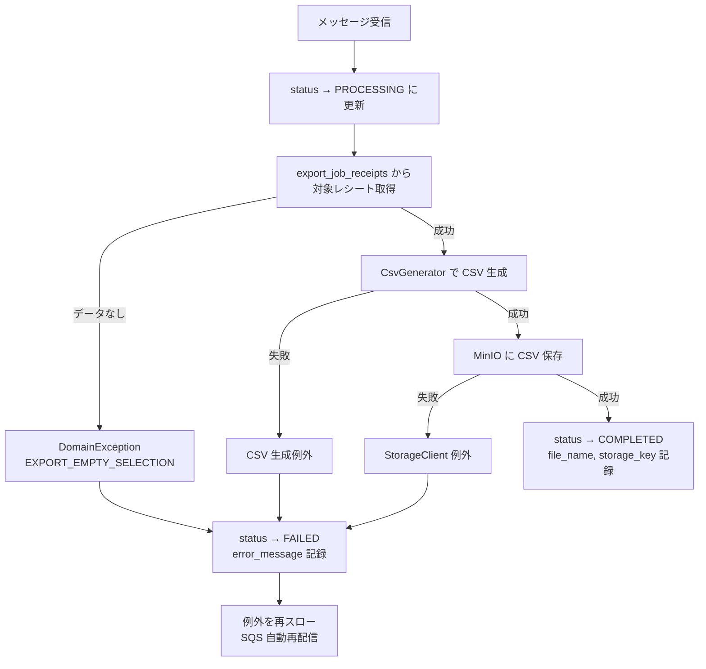

# エラーハンドリング設計書

## 1. 概要

領収書 OCR アプリケーションのエラーハンドリング設計。例外クラス体系、エラーコードとHTTPステータスの対応、レイヤーごとの処理方針を定義する。

### 設計方針

| 項目 | 方針 |
|---|---|
| 例外の基底クラス | `DomainException`（ドメイン層で定義） |
| エラーコード体系 | モジュール別の enum が `ErrorCode` インターフェースを実装 |
| HTTP 変換 | `GlobalExceptionHandler`（`@RestControllerAdvice`）で一元変換 |
| レスポンス形式 | API 設計書 §2.4 の共通エラーレスポンスに準拠 |
| フロントエンド | Axios インターセプターで共通処理 + Feature ごとの個別処理 |

### 参照ドキュメント

- [API 設計書](../2.基本設計/API設計書.md) — §2.4 共通エラーレスポンス、§2.5 エラーコード一覧
- [パッケージ・クラス設計書（BE）](./バックエンドクラス設計書.md) — §4 横断的関心事

---

## 2. 例外クラス体系

### 2.1 クラス図

```
RuntimeException
  └── DomainException                         # ドメイン例外の基底クラス（shared）
        ├── UploadBatchException               # アップロードバッチ固有の例外
        ├── OcrJobException                    # OCR ジョブ固有の例外
        ├── ReceiptException                   # レシート固有の例外
        └── ExportException                    # エクスポート固有の例外

Spring 標準例外（フレームワークがスロー）
  ├── MethodArgumentNotValidException          # @Valid バリデーション失敗
  ├── MaxUploadSizeExceededException           # Spring のファイルサイズ上限超過
  └── HttpMessageNotReadableException          # リクエストボディのパースエラー

JWT 認証例外
  └── JwtValidationException                   # JWT 検証失敗（infrastructure/security）
```

### 2.2 DomainException（基底クラス）

```java
package com.portfolio.receiptocr.shared.domain.exception;

public class DomainException extends RuntimeException {
    private final ErrorCode errorCode;
    private final String detail;

    public DomainException(ErrorCode errorCode) {
        super(errorCode.message());
        this.errorCode = errorCode;
        this.detail = null;
    }

    public DomainException(ErrorCode errorCode, String detail) {
        super(errorCode.message());
        this.errorCode = errorCode;
        this.detail = detail;
    }

    public ErrorCode getErrorCode() { return errorCode; }
    public String getDetail() { return detail; }
}
```

- `ErrorCode` を保持することで、エラーの種類と HTTP ステータスの決定を一箇所に集約
- `detail` は任意の補足情報（バリデーションの詳細メッセージ等）
- 非検査例外（`RuntimeException` 継承）として、try-catch の強制を避ける

### 2.3 ErrorCode インターフェース

```java
package com.portfolio.receiptocr.shared.domain.exception;

public interface ErrorCode {
    String code();
    String message();
    ErrorCategory category();
}
```

各モジュールの enum がこのインターフェースを実装する。`code()` は API レスポンスの `error.code` に対応する文字列。

### 2.4 ErrorCategory（エラー分類）

```java
package com.portfolio.receiptocr.shared.domain.exception;

public enum ErrorCategory {
    VALIDATION(400),
    AUTHENTICATION(401),
    AUTHORIZATION(403),
    NOT_FOUND(404),
    CONFLICT(409),
    INTERNAL(500);

    private final int httpStatus;

    ErrorCategory(int httpStatus) {
        this.httpStatus = httpStatus;
    }

    public int httpStatus() { return httpStatus; }
}
```

`ErrorCategory` が HTTP ステータスコードへのマッピングを一元管理する。

---

## 3. モジュール別エラーコード

### 3.1 共通エラーコード

すべてのモジュールで使用される共通のエラーコード。

```java
package com.portfolio.receiptocr.shared.domain.exception;

public enum CommonErrorCode implements ErrorCode {
    UNAUTHORIZED("UNAUTHORIZED", "認証に失敗しました", ErrorCategory.AUTHENTICATION),
    FORBIDDEN("FORBIDDEN", "このリソースへのアクセス権限がありません", ErrorCategory.AUTHORIZATION),
    INTERNAL_ERROR("INTERNAL_ERROR", "サーバー内部エラーが発生しました", ErrorCategory.INTERNAL);

    private final String code;
    private final String message;
    private final ErrorCategory category;

    // constructor, code(), message(), category()
}
```

### 3.2 アップロードバッチ（uploadbatch）

```java
package com.portfolio.receiptocr.uploadbatch.domain.exception;

public enum UploadBatchErrorCode implements ErrorCode {
    FILE_TOO_LARGE("FILE_TOO_LARGE", "ファイルサイズが上限（10MB）を超えています", ErrorCategory.VALIDATION),
    FILE_TYPE_NOT_ALLOWED("FILE_TYPE_NOT_ALLOWED", "許可されていないファイル形式です", ErrorCategory.VALIDATION),
    TOO_MANY_FILES("TOO_MANY_FILES", "アップロード枚数が上限（10枚）を超えています", ErrorCategory.VALIDATION),
    BATCH_NOT_FOUND("NOT_FOUND", "指定されたバッチが見つかりません", ErrorCategory.NOT_FOUND);

    // ...
}
```

| エラーコード | HTTP | 発生条件 |
|---|---|---|
| FILE_TOO_LARGE | 400 | 1ファイルが 10MB を超過 |
| FILE_TYPE_NOT_ALLOWED | 400 | JPEG, PNG, PDF 以外のファイル |
| TOO_MANY_FILES | 400 | 11枚以上のファイルをアップロード |
| NOT_FOUND | 404 | 存在しない batchId を指定 |

### 3.3 OCR ジョブ（ocrjob）

```java
package com.portfolio.receiptocr.ocrjob.domain.exception;

public enum OcrJobErrorCode implements ErrorCode {
    JOB_NOT_FOUND("NOT_FOUND", "指定されたジョブが見つかりません", ErrorCategory.NOT_FOUND),
    JOB_NOT_CONFIRMABLE("JOB_NOT_RETRYABLE", "このジョブは確定できる状態ではありません", ErrorCategory.CONFLICT),
    JOB_NOT_RETRYABLE("JOB_NOT_RETRYABLE", "このジョブはリトライできる状態ではありません", ErrorCategory.CONFLICT),
    OCR_PROCESSING_FAILED("INTERNAL_ERROR", "OCR 処理中にエラーが発生しました", ErrorCategory.INTERNAL),
    OCR_TIMEOUT("INTERNAL_ERROR", "OCR 処理がタイムアウトしました（60秒）", ErrorCategory.INTERNAL);

    // ...
}
```

| エラーコード | HTTP | 発生条件 |
|---|---|---|
| NOT_FOUND | 404 | 存在しない jobId を指定 |
| JOB_NOT_RETRYABLE | 409 | confirm 時に status が COMPLETED でない |
| JOB_NOT_RETRYABLE | 409 | retry 時に status が FAILED でない |
| INTERNAL_ERROR | 500 | Tesseract 処理中の例外（ワーカー内部） |
| INTERNAL_ERROR | 500 | 処理が 60 秒を超過（ワーカー内部） |

### 3.4 レシート（receipt）

```java
package com.portfolio.receiptocr.receipt.domain.exception;

public enum ReceiptErrorCode implements ErrorCode {
    RECEIPT_NOT_FOUND("NOT_FOUND", "指定されたレシートが見つかりません", ErrorCategory.NOT_FOUND),
    VALIDATION_ERROR("VALIDATION_ERROR", "リクエストパラメータが不正です", ErrorCategory.VALIDATION);

    // ...
}
```

| エラーコード | HTTP | 発生条件 |
|---|---|---|
| NOT_FOUND | 404 | 存在しない receiptId を指定 |
| VALIDATION_ERROR | 400 | 更新時のバリデーション失敗（amount < 1 等） |

### 3.5 エクスポート（export）

```java
package com.portfolio.receiptocr.export.domain.exception;

public enum ExportErrorCode implements ErrorCode {
    EXPORT_NOT_FOUND("NOT_FOUND", "指定されたエクスポートジョブが見つかりません", ErrorCategory.NOT_FOUND),
    EXPORT_NOT_READY("EXPORT_NOT_READY", "エクスポートがまだ完了していません", ErrorCategory.CONFLICT),
    EXPORT_EMPTY_SELECTION("VALIDATION_ERROR", "エクスポート対象のレシートが選択されていません", ErrorCategory.VALIDATION),
    EXPORT_PROCESSING_FAILED("INTERNAL_ERROR", "エクスポート処理中にエラーが発生しました", ErrorCategory.INTERNAL);

    // ...
}
```

| エラーコード | HTTP | 発生条件 |
|---|---|---|
| NOT_FOUND | 404 | 存在しない exportId を指定 |
| EXPORT_NOT_READY | 409 | download 時に status が COMPLETED でない |
| VALIDATION_ERROR | 400 | receiptIds が空 |
| INTERNAL_ERROR | 500 | CSV 生成中の例外（ワーカー内部） |

---

## 4. エラーコードと HTTP ステータスの対応一覧

API 設計書 §2.5 に定義されたエラーコードと、本設計のクラス間の対応を整理する。

| API エラーコード | HTTP | ErrorCategory | 発生元モジュール | 発生クラス |
|---|---|---|---|---|
| VALIDATION_ERROR | 400 | VALIDATION | 全モジュール | Spring @Valid / Service 層 |
| UNAUTHORIZED | 401 | AUTHENTICATION | infrastructure | JwtAuthenticationFilter |
| FORBIDDEN | 403 | AUTHORIZATION | infrastructure | Service 層（userId 不一致） |
| NOT_FOUND | 404 | NOT_FOUND | 全モジュール | Service 層（DB 検索結果なし） |
| FILE_TOO_LARGE | 400 | VALIDATION | uploadbatch | UploadBatchService |
| FILE_TYPE_NOT_ALLOWED | 400 | VALIDATION | uploadbatch | UploadBatchService |
| TOO_MANY_FILES | 400 | VALIDATION | uploadbatch | UploadBatchService |
| JOB_NOT_RETRYABLE | 409 | CONFLICT | ocrjob | OcrJobService |
| EXPORT_NOT_READY | 409 | CONFLICT | export | ExportService |
| INTERNAL_ERROR | 500 | INTERNAL | 全モジュール | GlobalExceptionHandler（予期しない例外） |

---

## 5. GlobalExceptionHandler

### 5.1 責務

`@RestControllerAdvice` で Controller 層からスローされた例外をキャッチし、API 設計書 §2.4 のフォーマットでエラーレスポンスに変換する。

### 5.2 ハンドリング対象と優先順位

| # | 例外クラス | 変換先 | 説明 |
|---|---|---|---|
| 1 | `DomainException` | ErrorCode に基づいて変換 | ドメイン例外（エラーコード付き） |
| 2 | `MethodArgumentNotValidException` | 400 VALIDATION_ERROR | @Valid バリデーション失敗 |
| 3 | `MaxUploadSizeExceededException` | 400 FILE_TOO_LARGE | Spring のファイルサイズ上限 |
| 4 | `HttpMessageNotReadableException` | 400 VALIDATION_ERROR | JSON パースエラー |
| 5 | `JwtValidationException` | 401 UNAUTHORIZED | JWT 検証失敗 |
| 6 | `Exception`（その他） | 500 INTERNAL_ERROR | 予期しない例外のフォールバック |

### 5.3 実装方針

```java
package com.portfolio.receiptocr.infrastructure.web;

@RestControllerAdvice
public class GlobalExceptionHandler {

    @ExceptionHandler(DomainException.class)
    public ResponseEntity<ApiErrorResponse> handleDomainException(DomainException ex) {
        ErrorCode errorCode = ex.getErrorCode();
        int status = errorCode.category().httpStatus();
        ApiErrorResponse body = new ApiErrorResponse(
            errorCode.code(),
            ex.getMessage(),
            ex.getDetail()
        );
        return ResponseEntity.status(status).body(body);
    }

    @ExceptionHandler(MethodArgumentNotValidException.class)
    public ResponseEntity<ApiErrorResponse> handleValidation(MethodArgumentNotValidException ex) {
        List<ApiErrorResponse.FieldError> details = ex.getBindingResult()
            .getFieldErrors().stream()
            .map(fe -> new ApiErrorResponse.FieldError(fe.getField(), fe.getDefaultMessage()))
            .toList();
        ApiErrorResponse body = new ApiErrorResponse(
            "VALIDATION_ERROR",
            "リクエストパラメータの検証に失敗しました",
            details
        );
        return ResponseEntity.badRequest().body(body);
    }

    @ExceptionHandler(MaxUploadSizeExceededException.class)
    public ResponseEntity<ApiErrorResponse> handleMaxUploadSize(MaxUploadSizeExceededException ex) {
        ApiErrorResponse body = new ApiErrorResponse(
            "FILE_TOO_LARGE",
            "ファイルサイズが上限を超えています",
            null
        );
        return ResponseEntity.badRequest().body(body);
    }

    @ExceptionHandler(Exception.class)
    public ResponseEntity<ApiErrorResponse> handleUnexpected(Exception ex) {
        // ログに詳細を記録（本番ではスタックトレースをクライアントに返さない）
        log.error("予期しないエラーが発生しました", ex);
        ApiErrorResponse body = new ApiErrorResponse(
            "INTERNAL_ERROR",
            "サーバー内部エラーが発生しました",
            null
        );
        return ResponseEntity.internalServerError().body(body);
    }
}
```

### 5.4 ApiErrorResponse

```java
package com.portfolio.receiptocr.infrastructure.web;

public record ApiErrorResponse(
    Error error
) {
    public ApiErrorResponse(String code, String message, Object details) {
        this(new Error(code, message, details));
    }

    public record Error(
        String code,
        String message,
        Object details
    ) {}

    public record FieldError(
        String field,
        String message
    ) {}
}
```

**レスポンス例:**

```json
{
  "error": {
    "code": "VALIDATION_ERROR",
    "message": "リクエストパラメータの検証に失敗しました",
    "details": [
      { "field": "amount", "message": "1以上の値を指定してください" },
      { "field": "storeName", "message": "必須項目です" }
    ]
  }
}
```

---

## 6. レイヤー別エラーハンドリング方針

### 6.1 Presentation 層（Controller）

| 方針 | 説明 |
|---|---|
| バリデーション | `@Valid` と Bean Validation アノテーションで入力検証。フレームワークが `MethodArgumentNotValidException` をスロー |
| 例外処理 | Controller 自身では try-catch しない。Service 層の例外は GlobalExceptionHandler に任せる |
| ファイルバリデーション | ファイル形式・サイズの検証は Service 層に委譲（MIME タイプの判定がビジネスロジックに属するため） |

### 6.2 Application 層（Service）

| 方針 | 説明 |
|---|---|
| 存在チェック | リソースの存在確認で見つからない場合は `DomainException(NOT_FOUND)` をスロー |
| 権限チェック | `user_id` の不一致は `DomainException(FORBIDDEN)` をスロー |
| 状態チェック | ステータス遷移の前提条件を検証し、不正な場合は `DomainException(CONFLICT)` をスロー |
| 外部サービスエラー | MinIO, SQS 等の障害は catch して `DomainException(INTERNAL_ERROR)` に変換 |

```java
// OcrJobService の確定処理の例
public Receipt confirmJob(UUID jobId, ConfirmRequest request, String userId) {
    OcrJob job = ocrJobRepository.findById(jobId)
        .orElseThrow(() -> new DomainException(OcrJobErrorCode.JOB_NOT_FOUND));

    if (!job.getUserId().equals(userId)) {
        throw new DomainException(CommonErrorCode.FORBIDDEN);
    }

    if (job.getStatus() != OcrJobStatus.COMPLETED) {
        throw new DomainException(OcrJobErrorCode.JOB_NOT_CONFIRMABLE);
    }

    // 確定処理...
}
```

### 6.3 Domain 層（Model）

| 方針 | 説明 |
|---|---|
| ステータス遷移の検証 | ドメインモデル内でステータス遷移の妥当性を検証し、不正な場合は `DomainException` をスロー |
| 不変条件の保護 | ドメインモデルのコンストラクタやメソッドで不変条件を検証 |

```java
// OcrJob ドメインモデルの例
public class OcrJob {
    public void confirm() {
        if (this.status != OcrJobStatus.COMPLETED) {
            throw new DomainException(OcrJobErrorCode.JOB_NOT_CONFIRMABLE);
        }
        this.status = OcrJobStatus.CONFIRMED;
    }

    public void markAsProcessing() {
        if (this.status != OcrJobStatus.QUEUED) {
            throw new DomainException(OcrJobErrorCode.JOB_NOT_RETRYABLE);
        }
        this.status = OcrJobStatus.PROCESSING;
    }
}
```

### 6.4 Infrastructure 層（Worker / MessageListener）

| 方針 | 説明 |
|---|---|
| OCR 処理の失敗 | DB ステータスを FAILED に更新後、例外を再スロー → SQS が自動再配信 |
| タイムアウト | `CompletableFuture.get(60, SECONDS)` でタイムアウト検知 → FAILED に更新 → 例外再スロー |
| 冪等性チェック | 処理開始時にステータスが QUEUED であることを確認。既に PROCESSING / COMPLETED ならスキップ |

```java
// OcrJobMessageListener の例
@SqsListener("receipt-ocr-queue")
public void handleOcrJob(OcrJobMessage message) {
    try {
        ocrJobService.processOcrJob(message);
    } catch (Exception e) {
        log.error("OCR ジョブ処理に失敗しました: jobId={}", message.jobId(), e);
        throw e;  // SQS の自動再配信に任せる
    }
}
```

---

## 7. フロントエンド エラーハンドリング

### 7.1 共通エラー処理（Axios インターセプター）

`lib/axios.ts` のレスポンスインターセプターで、API からのエラーレスポンスを共通処理する。

| HTTP ステータス | 処理 |
|---|---|
| 401 | Portal のログイン画面にリダイレクト |
| 403 | 「アクセス権限がありません」を Notification で表示 |
| 500 | 「サーバーエラーが発生しました」を Notification で表示 |
| その他 | Feature 側の catch ブロックに処理を委譲 |

```typescript
// lib/axios.ts の概念的な実装
axiosInstance.interceptors.response.use(
  (response) => response,
  (error) => {
    const status = error.response?.status;
    const apiError = error.response?.data?.error;

    if (status === 401) {
      window.location.href = '/portal/login';
      return Promise.reject(error);
    }

    if (status === 403) {
      showNotification('error', 'アクセス権限がありません');
      return Promise.reject(error);
    }

    if (status === 500) {
      showNotification('error', 'サーバーエラーが発生しました。時間をおいて再度お試しください');
      return Promise.reject(error);
    }

    return Promise.reject(error);
  }
);
```

### 7.2 Feature 別エラー処理

各 Feature のカスタムフックで、API エラーコードに応じた個別処理を行う。

#### upload（画面A）

| エラーコード | 表示メッセージ | UI の挙動 |
|---|---|---|
| FILE_TOO_LARGE | 「{ファイル名} のサイズが上限（10MB）を超えています」 | 該当ファイルをエラー表示 |
| FILE_TYPE_NOT_ALLOWED | 「{ファイル名} は対応していないファイル形式です」 | 該当ファイルをエラー表示 |
| TOO_MANY_FILES | 「アップロードは10枚までです」 | UploadButton を無効化 |

ファイルバリデーションはフロントエンドの `useFileSelection` で事前に行うため、サーバー側エラーは二重チェックの位置づけ。

#### ocrjob（画面B）

| エラーコード | 表示メッセージ | UI の挙動 |
|---|---|---|
| NOT_FOUND | 「ジョブが見つかりません」 | Notification でエラー表示 |
| JOB_NOT_RETRYABLE | 「このジョブは現在の状態では操作できません」 | Notification でエラー表示。ジョブ一覧を再取得 |
| VALIDATION_ERROR | フィールドごとのエラーメッセージ表示 | ConfirmForm の該当フィールドにエラーを表示 |

#### receipt（画面C）

| エラーコード | 表示メッセージ | UI の挙動 |
|---|---|---|
| NOT_FOUND | 「レシートが見つかりません」 | Notification でエラー表示。一覧を再取得 |
| VALIDATION_ERROR | フィールドごとのエラーメッセージ表示 | EditReceiptModal の該当フィールドにエラーを表示 |
| EXPORT_NOT_READY | 「エクスポートはまだ完了していません」 | ポーリング継続 |

### 7.3 API エラーレスポンス型

```typescript
// types/api.ts

interface ApiError {
  error: {
    code: string;
    message: string;
    details?: FieldError[];
  };
}

interface FieldError {
  field: string;
  message: string;
}

function isApiError(error: unknown): error is { response: { data: ApiError } } {
  // 型ガード
}

function getErrorCode(error: unknown): string | null {
  if (isApiError(error)) {
    return error.response.data.error.code;
  }
  return null;
}

function getFieldErrors(error: unknown): FieldError[] {
  if (isApiError(error)) {
    return error.response.data.error.details ?? [];
  }
  return [];
}
```

---

## 8. ワーカーのエラーハンドリング詳細

### 8.1 OCR ワーカー



### 8.2 エクスポートワーカー



### 8.3 ワーカーのエラーメッセージ

ワーカーで発生したエラーは `ocr_jobs.error_message` または `export_jobs.error_message` に記録する。ユーザーに表示される情報のため、技術的な詳細は含めず、概要レベルのメッセージとする。

| 発生箇所 | error_message の内容 |
|---|---|
| MinIO 接続失敗 | 「ファイルの取得に失敗しました」 |
| PDF 変換失敗 | 「PDF の変換に失敗しました」 |
| OCR タイムアウト | 「OCR 処理がタイムアウトしました（60秒）」 |
| OCR 処理エラー | 「OCR 処理中にエラーが発生しました」 |
| CSV 生成エラー | 「CSV の生成に失敗しました」 |
| CSV 保存エラー | 「CSV の保存に失敗しました」 |

技術的な詳細（スタックトレース等）はアプリケーションログに出力し、障害調査に使用する。

---

## 9. ログ出力方針

### 9.1 ログレベル

| レベル | 用途 | 例 |
|---|---|---|
| ERROR | 予期しないエラー、外部サービスの障害 | OCR 処理の失敗、MinIO 接続エラー |
| WARN | 予期されるが注意が必要な状況 | リトライ発生、冪等性チェックによるスキップ |
| INFO | 正常系の重要なイベント | ジョブの開始・完了、レシートの確定 |
| DEBUG | 開発時のデバッグ情報 | リクエスト/レスポンスの詳細、SQL クエリ |

### 9.2 エラーログの出力内容

エラーログには以下の情報を含める。

| 項目 | 目的 |
|---|---|
| タイムスタンプ | 障害発生時刻の特定 |
| ログレベル | 重要度の判別 |
| リクエスト ID / ジョブ ID | 処理の追跡 |
| ユーザー ID | 影響ユーザーの特定 |
| エラーコード | エラーの分類 |
| エラーメッセージ | 障害の概要 |
| スタックトレース | 根本原因の特定（ERROR レベルのみ） |

---

## 10. 設計判断の根拠

### 10.1 RuntimeException ベースの採用

**検討した代替案:** 検査例外（`Exception` 継承）

| 観点 | RuntimeException（採用） | 検査例外 |
|---|---|---|
| コードの簡潔さ | throws 宣言不要 | 呼び出し階層すべてに throws が必要 |
| GlobalExceptionHandler | Spring が自動的にキャッチ | 同じ |
| 見落としリスク | catch し忘れの可能性あり | コンパイラが検出 |

Spring Boot のエコシステムでは RuntimeException ベースの例外が一般的。GlobalExceptionHandler がフォールバックとして全例外をキャッチするため、見落としリスクは低い。

### 10.2 ErrorCode インターフェース + モジュール別 enum

**検討した代替案:** 単一の enum に全エラーコードを集約

| 観点 | モジュール別 enum（採用） | 単一 enum |
|---|---|---|
| モジュールの独立性 | 各モジュールが自身のエラーコードを管理 | 全モジュールが単一 enum に依存 |
| 変更の影響範囲 | エラーコード追加がモジュール内で完結 | 全モジュールに影響の可能性 |
| コード量 | enum が複数に分散 | 1ファイルで管理 |

4モジュール分割のアーキテクチャに合わせ、エラーコードもモジュール単位で管理する方が凝集度が高い。

### 10.3 フロントエンドのバリデーション二重化

ファイルバリデーション（形式・サイズ・枚数）はフロントエンドとバックエンドの両方で行う。

| 観点 | 判断 |
|---|---|
| UX | フロントエンドで即座にフィードバック（API 呼び出し不要） |
| セキュリティ | バックエンドが最終防衛線（フロントエンドのバリデーションは迂回可能） |
| 整合性 | 制約値（10MB、10枚、許可形式）は定数として管理し、乖離を防ぐ |

---

**作成日**: 2026-03-01
**版数**: 1.0
**ステータス**: 初版作成
