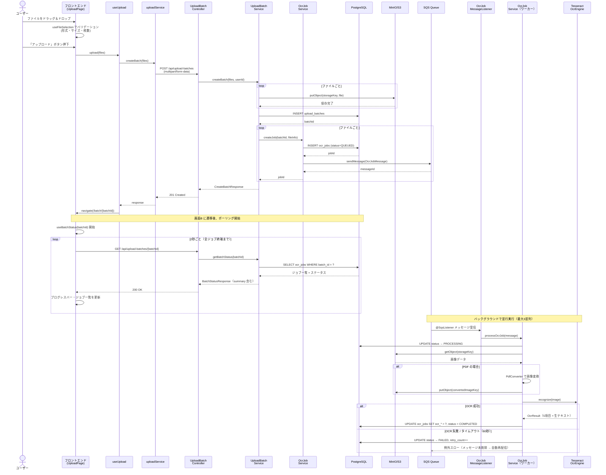
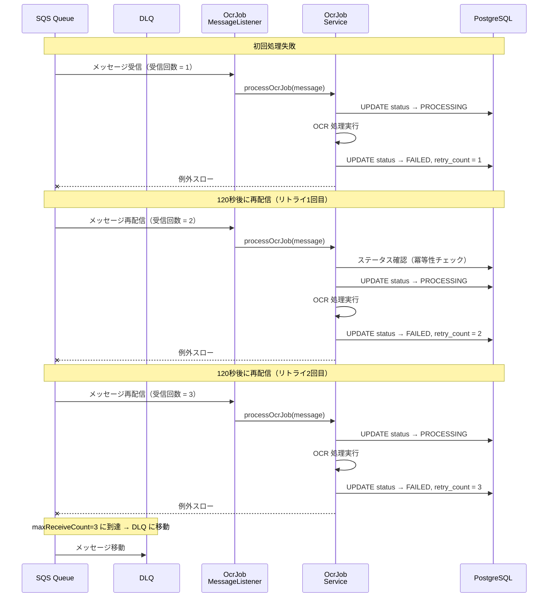
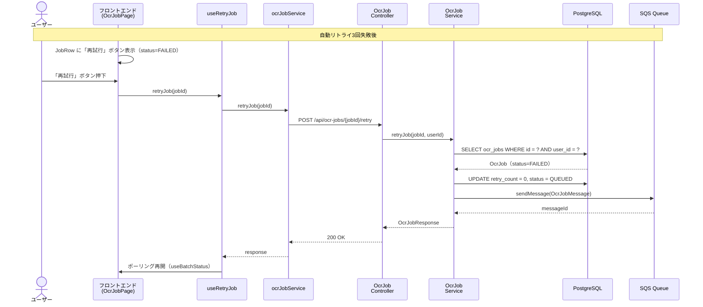
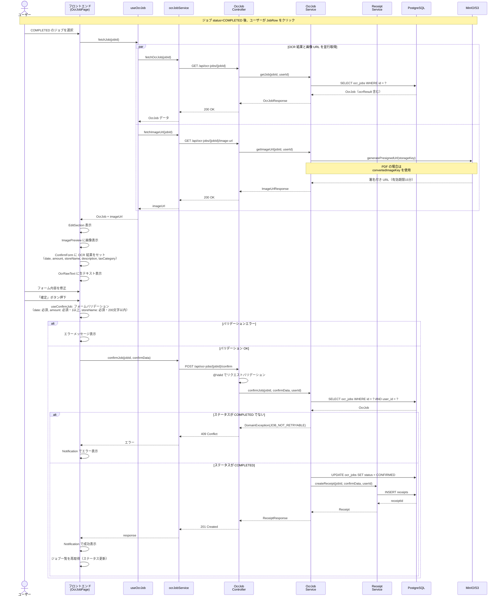
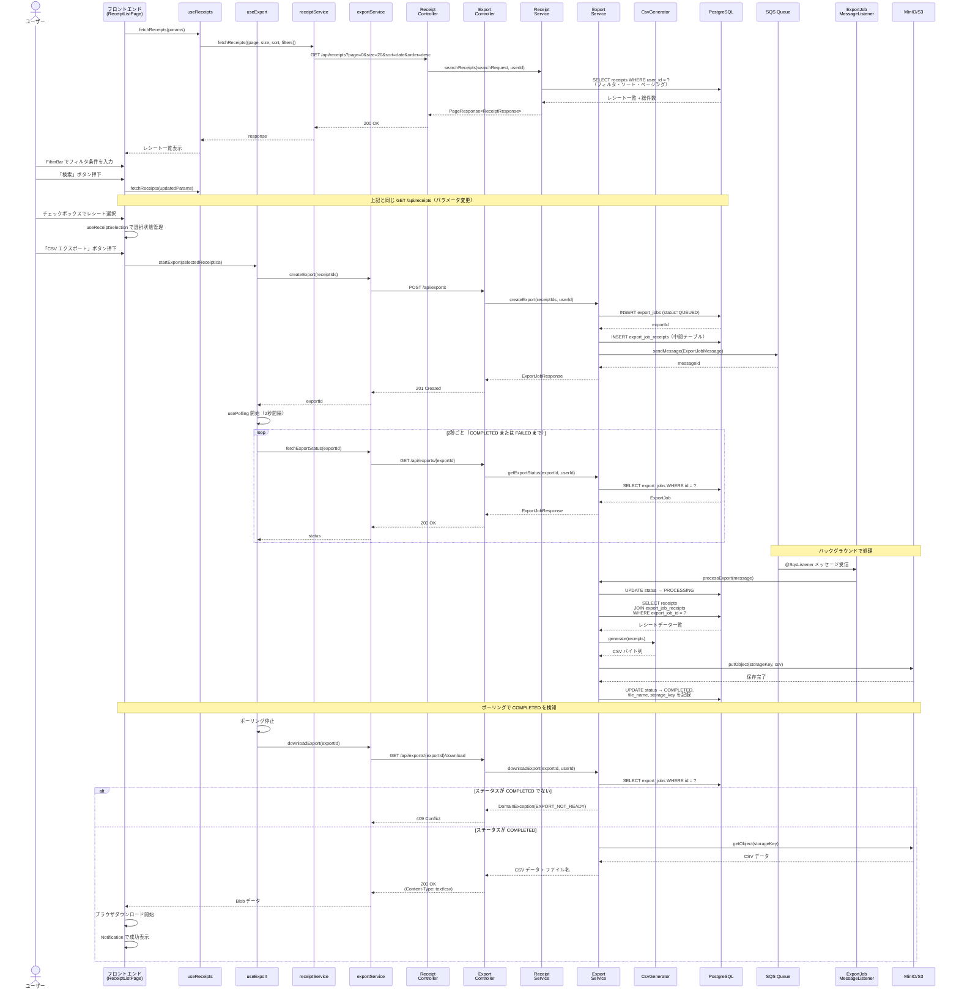
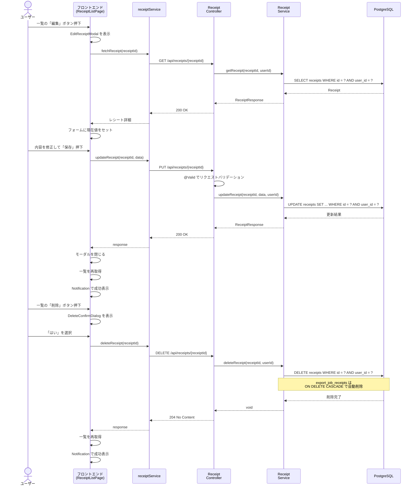
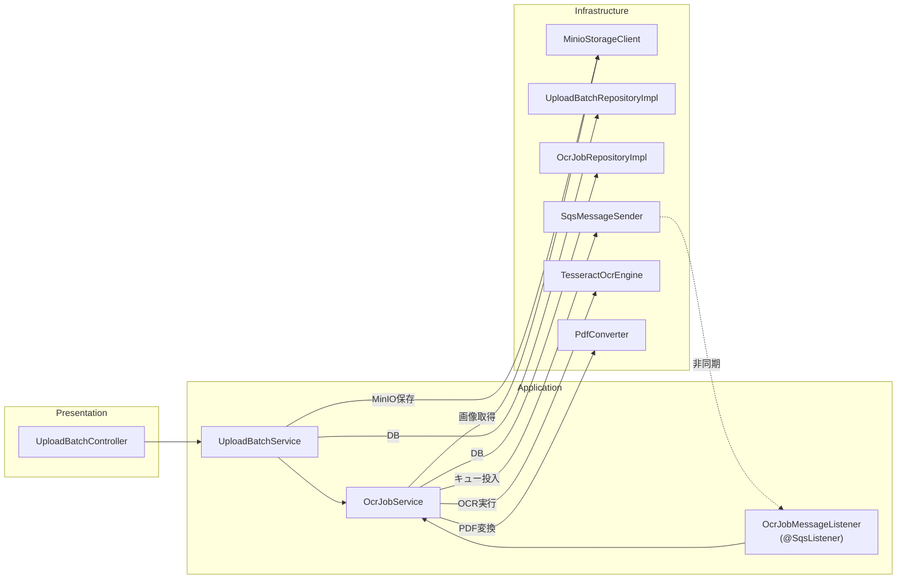
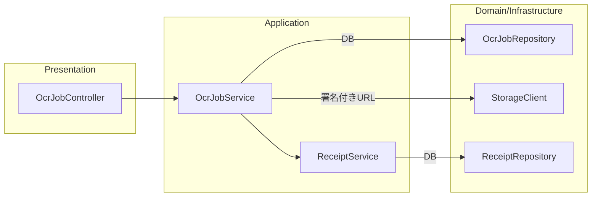
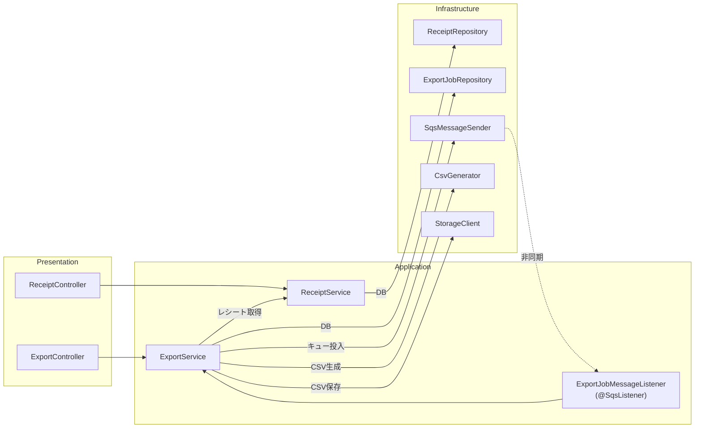

# シーケンス図

## 1. 概要

領収書 OCR アプリケーションの主要フローにおける処理順序を、レイヤーをまたいだシーケンス図で定義する。

### 対象フロー

| # | フロー | 概要 |
|---|---|---|
| 1 | アップロード → OCR 処理 | ファイルアップロード → MinIO 保存 → SQS 投入 → ワーカー OCR 実行 → ポーリングで完了検知 |
| 2 | 確認・確定 | OCR 結果の取得 → 画像プレビュー表示 → ユーザー編集 → 確定 → レシート作成 |
| 3 | エクスポート | レシート選択 → エクスポートジョブ作成 → ワーカー CSV 生成 → ダウンロード |

### 参照ドキュメント

- [API 設計書](../2.基本設計/API設計書.md)
- [非同期処理フロー設計書](../2.基本設計/非同期処理フロー設計書.md)
- [DB スキーマ設計書](../2.基本設計/DBスキーマ設計書.md)
- [パッケージ・クラス設計書（BE）](./バックエンドクラス設計書.md)
- [パッケージ・コンポーネント設計書（FE）](./フロントエンドコンポーネント設計書.md)

---

## 2. フロー①: アップロード → OCR 処理

### 2.1 全体シーケンス

ユーザーがファイルをアップロードしてから、OCR 処理が完了するまでの一連の流れ。

### 2.2 失敗→自動リトライのシーケンス

### 2.3 失敗→手動リトライのシーケンス

---

## 3. フロー②: 確認・確定

ユーザーが OCR 完了済みジョブの結果を確認・編集して確定するフロー。

---

## 4. フロー③: エクスポート

確定済みレシートを選択して CSV エクスポートするフロー。

### 4.1 全体シーケンス

### 4.2 レシート編集・削除のシーケンス

---

## 5. クラス間の呼び出し関係まとめ

各フローで登場するクラスの呼び出し関係を整理する。

### 5.1 フロー①: アップロード → OCR

### 5.2 フロー②: 確認・確定

### 5.3 フロー③: エクスポート

---

**作成日**: 2026-03-01
**版数**: 1.0
**ステータス**: 初版作成
